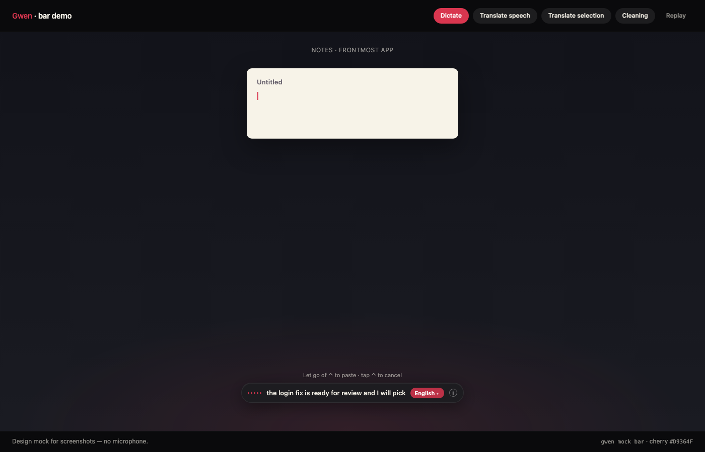
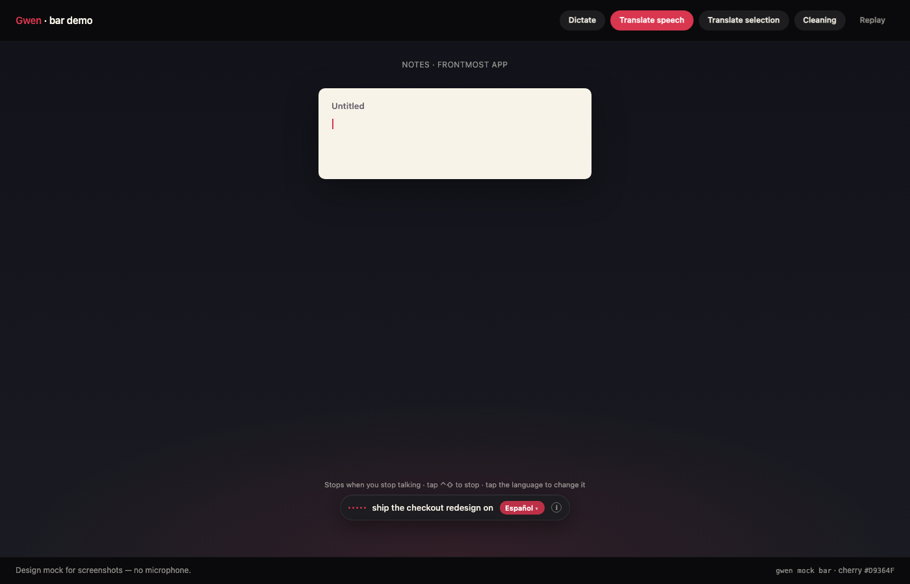
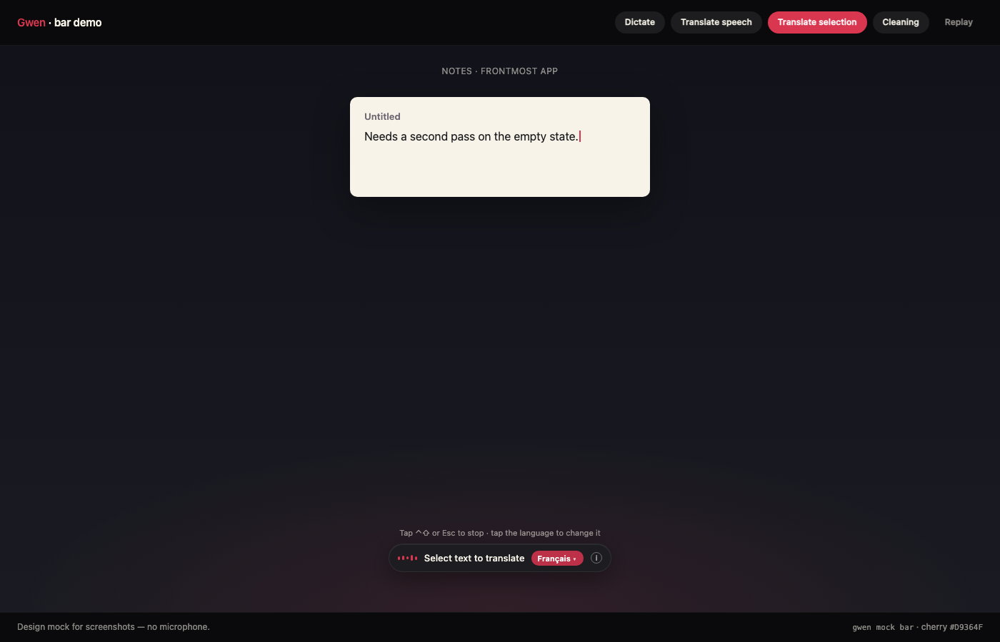
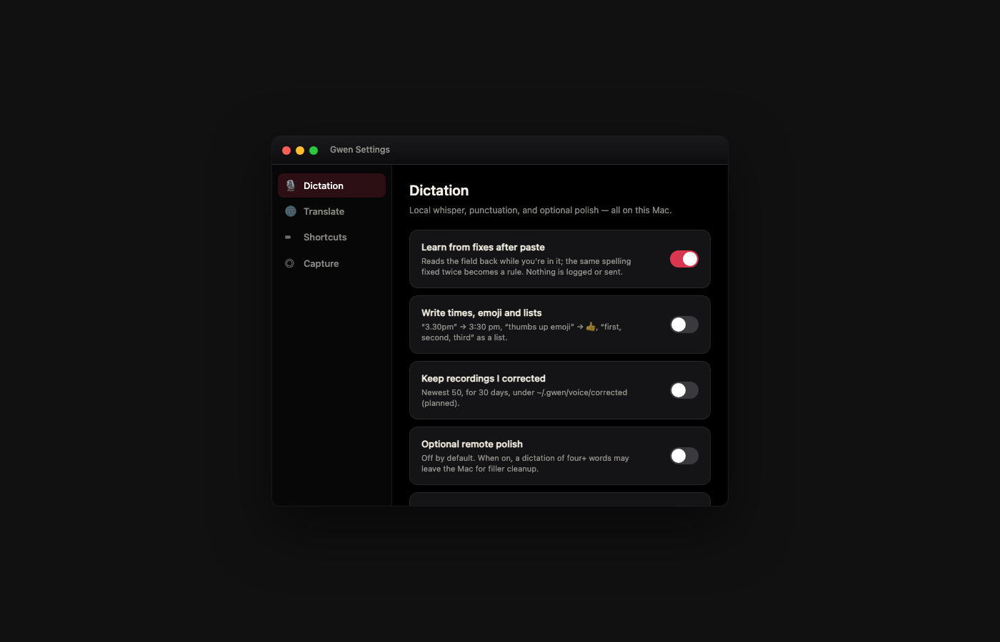

# Gwen

**Dictate and translate in any app. For macOS. Local by default.**

Gwen is a bottom-bar dictation product: hold a key, speak, and the text is pasted where the cursor is. She translates
a selection or what you say into a language you pick. Transcription and translation stay on this Mac: dictation uses a
local whisper.cpp server by default, punctuation runs on this Mac too, and translation uses Apple's on-device
Translation framework (macOS 15 or later). Polish is opt-in: you can have an agent CLI on this Mac (Claude Code today) tidy each take; that one step is the
only thing that leaves the Mac, and it is off by default.

| Key | What it does |
| --- | --- |
| Hold ⌃ | Dictate; let go to finish. The text is pasted where the cursor is |
| ⌃⌃, or "Hey Gwen" | Dictate hands-free; it ends when you stop talking |
| Tap ⌃⇧ | Translate the selection (or what you copied in the last minute), replace in place when possible |
| Hold ⌃, tap ⇧ twice | Translate what you say |
| Tap ⌃ | Stop whatever the bar is doing: nothing is pasted, sent or started |

## Preview



*Hold ⌃ — live words in the bottom bar, paste on release*



*Translate what you say — pick the language on the chip*



*Tap ⌃⇧ — translate the selection in place*



*Native Settings — Dictation, Language, Shortcuts, Capture*

## Status

Shipped in this repo:

- **HUD** — menu bar + bottom pill (`macapp/`), idle language chip, native Settings
- **Listener** — `gwen listen`: Mic FIFO → local whisper → punctuation → paste
- **Wake / learn** — Hey Gwen, taught in your voice on first run (retrain in Settings → Dictation); learned words under `~/.gwen/`
- **Translate** — ⌃⇧ selection/clipboard with in-place replace, AX verify, cancel/race hardening
- **Site** — [site/index.html](site/index.html) (Funnel/Geist dark UI, Gwen-only MIT/local copy)
- **Mocks** — scripted HUD/HTML demos when you want a dry run

Whisper installs and starts with `gwen setup` / `gwen listen` / `gwen hud` (VoiceMode whisper.cpp on `127.0.0.1:2022`).

Other apps can drive Gwen through `gwen://` (see below).

## Build & run

```sh
./bin/gwen setup          # install + start Whisper on 127.0.0.1:2022
./bin/gwen build          # swiftc → dist/Gwen.app (~/.gwen/Gwen.app → symlink)
./bin/gwen install        # CLI + login listener (Gwen-only)
./bin/gwen bundle         # dist/Gwen.app + Gwen.dmg
./bin/gwen hud            # menu bar + bottom pill (also ensures Whisper)
./bin/gwen settings       # native Gwen Settings
./bin/gwen listen         # Mic FIFO + whisper + paste (ensures Whisper)
./bin/gwen listen --no-wake
./bin/gwen mock bar       # scripted dictate → clean → paste on Gwen.app
./bin/gwen mock bar html  # HTML fallback (no native HUD)
```

Or compile by hand:

```sh
./bin/gwen build   # → dist/Gwen.app; ~/.gwen/Gwen.app symlinked
```

## Demos

```sh
./bin/gwen mock              # list
./bin/gwen mock bar          # Gwen.app HUD scripted dictation
./bin/gwen mock translate    # speech-translate scene on HUD
./bin/gwen mock selection    # selection scene on HUD
./bin/gwen mock settings     # native Settings (or HTML)
./bin/gwen mock punctuation  # before/after samples in the terminal
./bin/gwen mock fixes        # learn-words storyboard (text)
```

### Gwen Settings (native)

Dictation · Language · Shortcuts (read-only) · Capture (show bar in screenshots)

Prefs: `~/.gwen/config.json` plus `translateTo` in app defaults. Idle bar chip shows Mac / Key / language and opens the same Language menu.

### Polish with an agent (opt-in)

By default punctuation and cleanup are rules on this Mac. To have an agent format each take instead, turn on
Settings → Dictation → Polish with an agent. It applies from the next take.

Gwen runs the local `claude` CLI (no tools, capped at $0.05 a take) and keeps the rules result when the CLI is
missing, slow, or changes what you said. `claude` is the only agent wired today; to pin its model, set
`{ "transcribe": { "model": "…" } }` in `~/.gwen/config.json`.

### `gwen://` (for other apps)

| URL | Does |
| --- | --- |
| `gwen://ping` | Nothing; reaching Gwen is the answer |
| `gwen://dictate?mode=hold\|free` | Start dictating; call it again to finish and paste |
| `gwen://translate?mode=selection\|speech` | Same as tap ⌃⇧ / hold ⌃ + ⇧⇧ |

After `gwen install` Gwen runs from login with no terminal; opening Gwen.app (or a `gwen://` link) while it is
stopped starts that login listener.

### Site

Static marketing page in [`site/`](site/). Funnel Display/Sans, Geist Mono, dark tokens, cherry accent. GitHub placeholder: `https://github.com/mblancodev/gwen`.

## Support

If Gwen saves you time, [buy me a coffee](https://www.buymeacoffee.com/manuelblancodev).

[](https://www.buymeacoffee.com/manuelblancodev)

## License

This code is open-source and free. Do what you want with it. If you want to contribute or fork it, by all means do it.

MIT. See [LICENSE](LICENSE).
